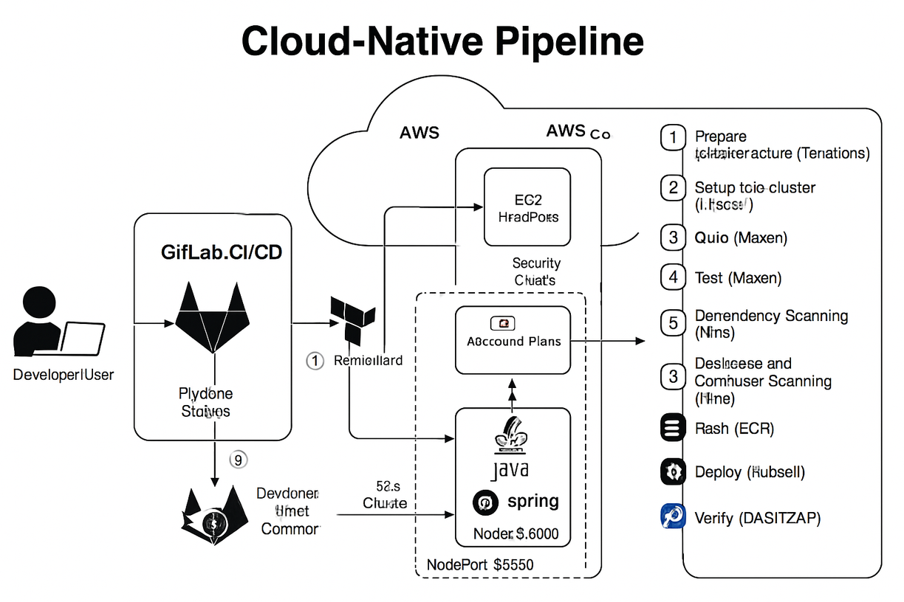
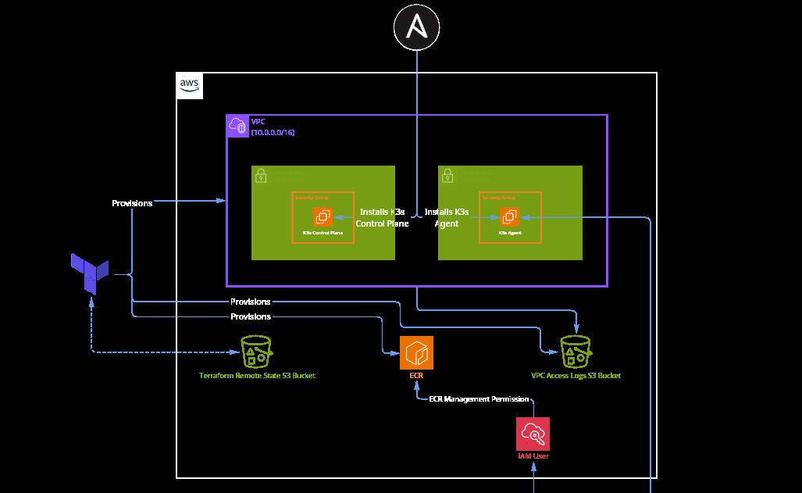
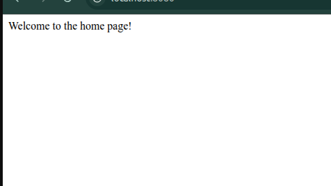

# Cloud-Native Pipeline: Java Spring Boot - Docker - AWS - Terraform - Ansible - Kubernetes - GitLab CI/CD

## Project Overview

This project presents a comprehensive and fully automated pipeline designed for deploying a Java Spring Boot application to a k3s Kubernetes cluster on AWS. The core idea is to leverage modern DevOps tools to ensure a seamless and repeatable deployment process. From code inception to user delivery, every step is automated and professional.

Our primary goal with this project is to demonstrate how to build a robust and reliable CI/CD system that integrates Infrastructure as Code (IaC), Configuration Management, Docker containers, and Kubernetes orchestration, all managed by GitLab CI/CD automation.

## Key Features

*   **Infrastructure as Code (IaC)**: AWS resources such as Virtual Private Cloud (VPC), Elastic Compute Cloud (EC2) instances, and Elastic Container Registry (ECR) are provisioned and managed using Terraform.
*   **Automated Kubernetes Cluster Setup**: A k3s Kubernetes cluster is automatically configured and set up on EC2 instances using Ansible playbooks, ensuring a consistent and ready-to-use environment.
*   **Application Containerization**: The Java Spring Boot application is containerized using Docker, making it highly portable and easy to run across different environments.
*   **End-to-End CI/CD Automation**: The GitLab CI/CD pipeline orchestrates the entire process, including building, testing, containerizing, pushing to ECR, deploying to Kubernetes, and performing comprehensive security scans (SAST and DAST).
*   **Kubernetes Deployment**: The application is deployed to the k3s cluster using native Kubernetes manifests, maximizing the benefits of Kubernetes capabilities.
*   **Monitoring & Verification**: The pipeline includes Smoke Tests and Dynamic Application Security Testing (DAST) to ensure the application's health and identify any security vulnerabilities post-deployment.

## Technologies and Tools Used

This project relies on a suite of modern technologies and tools essential for DevOps and cloud-native application development:

*   **Cloud Provider**: AWS (Amazon Web Services)
*   **Infrastructure as Code**: Terraform
*   **Configuration Management**: Ansible
*   **Containerization**: Docker
*   **Container Orchestration**: Kubernetes (k3s)
*   **Application Framework**: Java Spring Boot
*   **CI/CD**: GitLab CI/CD
*   **Security Scanning**: SAST (Static Application Security Testing) using Trivy, and DAST (Dynamic Application Security Testing) using ZAP.
*   **Build Tool**: Maven

## Project Structure

This repository is organized into several key directories, each containing specific components of the Cloud-Native Pipeline. Detailed explanations for each part are provided directly within this README:

```
Cloud-Native-Pipeline/
├── .gitlab-ci.yml        # Main GitLab CI/CD pipeline configuration file
├── Dockerfile            # Dockerfile for building the Spring Boot application image
├── pom.xml               # Main Maven project file for building the Java application
├── src/                  # Source code directory for the Java Spring Boot application
├── infrastructure/       # Infrastructure as Code configurations (Terraform)
│   └── terraform/
│       ├── envs/         # Deployment environments (e.g., prod)
│       └── modules/      # Reusable Terraform modules
├── ansible/              # Ansible configurations for k3s cluster setup
│   ├── ansible.cfg
│   ├── inventory.yml
│   ├── playbook.yml
│   └── roles/
├── k8s/                  # Kubernetes YAML manifests for deployment
│   ├── deploy.yml
│   └── service.yml
├── install.sh            # Helper script for tool installation (e.g., Trivy)
├── mvnw                  # Maven Wrapper script (ensures consistent Maven version)
└── mvnw.cmd              # Maven Wrapper script for Windows
```

## Architecture Diagram

The following diagram illustrates the complete architecture of the Cloud-Native Pipeline, showing how all components interact throughout the application's lifecycle:


## Component Details

This section provides a detailed explanation of each major component within the project, from infrastructure provisioning to application deployment on Kubernetes.

### 1. Infrastructure with Terraform

This part of the project is responsible for building all the necessary infrastructure on AWS using Terraform. The goal is to automatically and repeatedly prepare the environment where the application will run, ensuring that the deployment environment is always consistent and free from manual errors.

#### Project Description

This directory contains the Terraform configurations that set up the foundational AWS infrastructure for the Cloud-Native Pipeline. It configures the network (VPC), compute resources (EC2 instances for the k3s cluster), an Elastic Container Registry (ECR) for Docker images, and logging capabilities. The infrastructure is designed to be robust, scalable, and adheres to Infrastructure as Code principles.

#### Technologies and Tools Used

*   **Terraform**: The primary tool for Infrastructure as Code (IaC).
*   **AWS (Amazon Web Services)**: The cloud provider where all resources are deployed.
    *   **VPC (Virtual Private Cloud)**: An isolated and private network environment.
    *   **EC2 (Elastic Compute Cloud)**: Virtual servers that host the k3s cluster.
    *   **ECR (Elastic Container Registry)**: A fully-managed Docker container image registry.
    *   **Security Groups**: Virtual firewalls that control traffic to EC2 instances.
    *   **CloudWatch Logs**: For centralized log collection.

#### Directory Layout

```
infrastructure/terraform/
├── envs/                 # Environment configurations (e.g., prod)
│   └── prod/
│       ├── backend.tf    # Terraform backend configuration (e.g., S3 for state management)
│       ├── main.tf       # Main Terraform configuration file for this environment
│       ├── output.tf     # Terraform outputs (e.g., server IPs)
│       ├── provider.tf   # AWS provider configuration
│       ├── variables.tf  # Variable definitions used in the environment
│       └── vars.tfvars   # Variable values for this specific environment
└── modules/              # Reusable Terraform modules
    ├── ECR/              # ECR module for creating Docker image repositories
    ├── compute/          # Compute module for creating EC2 instances and security groups
    ├── logging/          # Logging module for setting up CloudWatch Logs
    └── network/          # Network module for creating VPC and Subnets
```

#### Explanation of Infrastructure Code

This Terraform setup is modular, with each core component (like networking or compute) having its own dedicated Module. The `envs/prod/main.tf` file orchestrates these Modules to build the complete infrastructure.

##### `envs/prod/main.tf`

This is the main configuration file for the production environment. It calls and configures the following modules:

*   **`network` module**: (Source: `../../modules/network`)
    *   **VPC**: Creates a VPC with a CIDR block of `10.0.0.0/16`.
    *   **Subnets**: Defines two public subnets with CIDR blocks `10.0.3.0/24` and `10.0.2.0/24`.
    *   **Internet Gateway**: Sets up an Internet Gateway to allow public internet access.
    *   **Route Tables**: Configures route tables for the public subnets.

*   **`compute` module**: (Source: `../../modules/compute`)
    *   **EC2 Instances**: Provisions two EC2 instances:
        *   `k3s-controlplane`: An instance of type `t2.small`, deployed in `subnet1`, and tagged with `Role=controlplane`.
        *   `k3s-worker`: An instance of type `t2.micro`, deployed in `subnet2`, and tagged with `Role=worker`.
    *   **Security Group**: Creates a Security Group named `allow ssh, http, and K3s required ports` with ingress rules for:
        *   SSH (port 22) from anywhere (`0.0.0.0/0`).
        *   HTTP (port 80) from anywhere (`0.0.0.0/0`).
        *   k3s API (port 6443) from anywhere (`0.0.0.0/0`).
        *   ETCD (port 2379) from within the VPC (`10.0.0.0/16`).
        *   Flannel VXLAN (UDP 8472) from within the VPC (`10.0.0.0/16`).
        *   Kubelet Metrics (port 10250) from within the VPC (`10.0.0.0/16`).
        *   Wireguard (UDP 51820, 51821) from within the VPC (`10.0.0.0/16`).
        *   Spegel Registry (ports 5001, 6443) from within the VPC (`10.0.0.0/16`).
    *   **Egress Rules**: Allows all outbound traffic (`0.0.0.0/0`).
    *   **Key Pair**: Associates an SSH key pair named `instance-key-pair` with the instances.

*   **`ecr` module**: (Source: `../../modules/ECR`)
    *   **ECR Repository**: Creates an ECR repository with the name specified by `var.ecr_repository_name`.
    *   **Configuration**: Sets `force_delete` to `true`, `image_tag_mutability` to `IMMUTABLE`, and `encryption_type` to `AES256`.
    *   **Image Scanning**: Enables image scanning on push and configures filters to scan all images (`*`).
    *   **Lifecycle Policy**: Includes a lifecycle policy to expire untagged images older than 14 days.

*   **`logging` module**: (Source: `../../modules/logging`)
    *   Configures CloudWatch logging with a retention period of 7 days.

##### Modules (`modules/`)

Each subdirectory under `modules/` (e.g., `ECR`, `compute`, `logging`, `network`) contains reusable Terraform code for specific AWS resources. These modules encapsulate resource definitions, variables, and outputs, promoting reusability and maintainability across different environments.



### 2. k3s Cluster Setup with Ansible

This section focuses on automating the setup and configuration of the k3s Kubernetes cluster on the EC2 instances provisioned by Terraform. Ansible ensures that the cluster is set up consistently and reliably, saving significant time and effort.

#### Project Description

This directory contains Ansible playbooks and roles designed to automate the setup and configuration of a two-node k3s (Lightweight Kubernetes) cluster on AWS EC2 instances. These playbooks handle common operating system preparations, the installation of the k3s control plane, and the joining of a worker node to the cluster. This automation ensures a consistent and repeatable deployment of the Kubernetes environment.

#### Technologies and Tools Used

*   **Ansible**: Automation engine for configuration management and orchestration.
*   **k3s**: A lightweight Kubernetes distribution.
*   **AWS EC2**: Virtual servers on AWS.
*   **Python**: Used for Ansible execution and `boto3` for AWS interactions (implicitly via GitLab CI/CD).

#### Directory Layout

```
ansible/
├── ansible.cfg           # Ansible configuration file
├── inventory.yml         # Inventory file (dynamically generated in CI/CD)
├── playbook.yml          # Main playbook for orchestrating tasks
└── roles/                # Directory for Ansible roles
    ├── common/           # Role for general OS preparations
    ├── k3s_agent/        # Role for joining worker nodes to the cluster
    └── k3s_control_plane/ # Role for installing the k3s Control Plane
```

#### Explanation of Ansible Configuration

##### `ansible.cfg`

This file contains Ansible configuration settings, such as paths to roles, inventory, and other parameters that control Ansible's behavior.

##### `inventory.yml`

This file defines the hosts that Ansible will manage. It categorizes hosts into groups like `controlplane` and `worker`. In this project's context, GitLab CI/CD dynamically generates this file, populating it with the public and private IP addresses of the EC2 instances provisioned by Terraform.

##### `playbook.yml`

This is the main orchestration playbook. It defines the sequence of tasks and roles to be applied to different host groups:

*   **Common setup for all nodes**: Applies the `common` role to all hosts to perform initial operating system setup.
*   **Setup K3s Control Plane Node**: Applies the `k3s_control_plane` role to the host in the `controlplane` group. This role is responsible for installing the k3s server and extracting the node token.
*   **Setup K3s Worker Node**: Applies the `k3s_agent` role to the host in the `worker` group. It uses the `k3s_token` variable, dynamically retrieved from the control plane node, to join the worker to the k3s cluster.

##### Roles (`roles/`)

Each subdirectory under `roles/` represents a specific role that performs a set of tasks:

*   **`common/`**: This role handles general operating system preparations, such as updating packages and installing necessary utilities.
*   **`k3s_control_plane/`**: This role is dedicated to setting up the k3s server on the control plane node. Its tasks typically include:
    *   Downloading and installing the k3s binary.
    *   Starting the k3s service.
    *   Retrieving the k3s node token for worker node registration.
*   **`k3s_agent/`**: This role is responsible for joining a worker node to the k3s cluster. Its tasks typically include:
    *   Downloading and installing the k3s binary on the worker node.
    *   Configuring the k3s agent to connect to the control plane using the provided token.
    *   Starting the k3s agent service.

### 3. Java Spring Boot Application

This is the core of the project: a Java Spring Boot application that will be containerized and deployed to the Kubernetes cluster. Although simple, this application demonstrates how to handle Java applications in a cloud-native environment.

#### Project Description

This directory contains the source code for a simple Java Spring Boot application. This application serves as the core component that is containerized, pushed to AWS ECR, and deployed to the k3s Kubernetes cluster as part of the Cloud-Native Pipeline. It is a basic web application designed to demonstrate the end-to-end CI/CD process.

#### Technologies and Tools Used

*   **Java 17**: The programming language used for the application.
*   **Spring Boot**: A framework for building stand-alone, production-grade Spring applications.
*   **Maven**: A build automation tool used for compiling, testing, and packaging the application.

#### Directory Layout

```
src/
├── main/java/com/fawry/hello                # Main source code
│   ├── jhello/
│   │        ├── HelloApplication.java  # Main entry point of the applicationA
│   │       
│   │               
│   └── resources/        # Application resources (e.g., configuration files)
│       └── application.properties # Spring Boot configuration file
└── test/com/fawry/hello                # Test files
                    └── HelloApplicationTests.java # Unit and integration tests
```

#### Explanation of Key Files

*   **`pom.xml`**: The Maven Project Object Model file. It defines project dependencies (e.g., `spring-boot-starter-web`, `spring-boot-starter-test`), build plugins, and project metadata. It specifies Java 17 as the target version.
*   **`src/main/java/com/fawry/hello/HelloApplication.java`**: The main entry point for the Spring Boot application. It contains the `main` method that bootstraps the Spring application context.
*   **`src/main/java/com/fawry/hello/HelloController.java`**: A simple Spring REST controller that handles incoming HTTP requests and defines API endpoints for the application.
*   **`src/main/resources/application.properties`**: A configuration file for the Spring Boot application. It can be used to define properties like the server port, database connections, etc.
*   **`src/test/java/com/fawry/hello/HelloApplicationTests.java`**: Contains unit and integration tests for the Spring Boot application, ensuring its functionality and reliability.

### 4. Dockerfile

The Dockerfile is the recipe used to build the Docker image for the Spring Boot application. It defines all the necessary steps to transform our application into a portable container that can run anywhere.

#### Explanation of Dockerfile

```dockerfile
FROM eclipse-temurin:17-alpine
WORKDIR /opt/app/
COPY  target/*.jar  /app.jar
EXPOSE 8080
ENTRYPOINT ["java", "-jar", "/app.jar", "api"]
```

*   **`FROM eclipse-temurin:17-alpine`**: This line specifies the base image for our Docker image. Here, we use `eclipse-temurin:17-alpine`, which is a lightweight image based on Alpine Linux and includes OpenJDK 17, making it highly suitable for Java applications.
*   **`WORKDIR /opt/app/`**: Sets the working directory inside the container. Any subsequent commands will be executed within this directory.
*   **`COPY target/*.jar /app.jar`**: Copies the application's JAR file (which is built during the `build` stage in the CI/CD pipeline) from the `target/` directory in the build context to `/app.jar` inside the container.
*   **`EXPOSE 8080`**: Declares that the container listens on port 8080. This is merely an informational declaration and does not actually publish the port to the host system, but it helps in documenting the ports used by the application.
*   **`ENTRYPOINT ["java", "-jar", "/app.jar", "api"]`**: This command will be executed when the container starts. It runs the application's JAR file using Java, passing `api` as an argument to the application. This ensures the application starts correctly within the container.

### 5. Kubernetes Manifests

This directory contains the Kubernetes YAML files used to deploy the Java Spring Boot application onto the k3s cluster. These files define the Deployment for managing application pods and the Service for exposing the application to the network. The goal is to provide a straightforward and direct method for deploying the application on Kubernetes, seamlessly integrating with the CI/CD Pipeline.

#### Project Description

This directory contains the Kubernetes YAML manifests used to deploy the Java Spring Boot application onto the k3s cluster. It defines the Deployment to manage application pods and the Service to expose the application to the network. These manifests are designed to be simple and easy to deploy, integrating smoothly with the CI/CD Pipeline.

#### Technologies and Tools Used

*   **Kubernetes**: Container orchestration platform (specifically k3s).
*   **YAML**: The standard language for Kubernetes manifest files.
*   **Docker**: Containerization technology for the Spring Boot application.

#### Directory Layout

```
k8s/
├── deploy.yml            # Kubernetes Deployment file
└── service.yml           # Kubernetes Service file
```

#### Explanation of Kubernetes Manifests

##### `deploy.yml` - Kubernetes Deployment

This manifest defines a Kubernetes Deployment named `springboot-app`. A Deployment ensures that a specified number of replicas of your application are running and handles updates in a controlled manner.

*   **`apiVersion: apps/v1`**: Specifies the Kubernetes API version.
*   **`kind: Deployment`**: Declares this object as a Deployment.
*   **`metadata.name: springboot-app`**: The name of the Deployment.
*   **`spec.replicas: 2`**: Configures the Deployment to maintain 2 replicas (pods) of the application.
*   **`spec.selector.matchLabels.app: springboot-app`**: Defines how the Deployment finds which pods to manage. It matches pods with the label `app: springboot-app`.
*   **`spec.template`**: Describes the pods that the Deployment will create.
    *   **`metadata.labels.app: springboot-app`**: Labels applied to the pods created by this Deployment.
    *   **`spec.containers`**: Defines the containers within the pod.
        *   **`name: app`**: The name of the container.
        *   **`image: $ECR_REPO_URL:$Docker_Image_name:$Image_Tag`**: The Docker image to use for the container. This image is dynamically pulled from AWS ECR, with its name and tag provided via CI/CD variables.
        *   **`ports.containerPort: 8080`**: The port on which the Spring Boot application listens inside the container.

##### `service.yml` - Kubernetes Service (NodePort)

This manifest defines a Kubernetes Service named `springboot-service`. A Service defines a logical set of Pods and a policy by which to access them. This particular service is of type `NodePort`.

*   **`apiVersion: v1`**: Specifies the Kubernetes API version.
*   **`kind: Service`**: Declares this object as a Service.
*   **`metadata.name: springboot-service`**: The name of the Service.
*   **`spec.type: NodePort`**: Exposes the Service on a static port on each Node's IP address. This makes the application accessible from outside the cluster using `<NodeIP>:<NodePort>`.
*   **`spec.selector.app: springboot-app`**: Selects the pods that this Service will route traffic to. It targets pods with the label `app: springboot-app`.
*   **`spec.ports`**: Defines the ports exposed by the Service.
    *   **`protocol: TCP`**: The protocol used for the port.
    *   **`port: 8080`**: The port on which the Service itself listens.
    *   **`targetPort: 8080`**: The port on the pods to which the Service will send traffic.
    *   **`nodePort: 30080`**: The specific port opened on each Node's IP address. This is the port used to access the application externally (e.g., `http://<public-node-ip>:30080`).

### 6. GitLab CI/CD Pipeline

This is the most critical part of the project, as it connects all components and automates the entire process. The `.gitlab-ci.yml` file defines all the steps and stages that the code goes through from its inception until deployment.

#### Pipeline Description

The `.gitlab-ci.yml` file defines a multi-stage pipeline that automates the entire process from infrastructure provisioning to application deployment and verification. Each stage has a specific function, ensuring a smooth and efficient CI/CD process.

#### Stages

The pipeline is divided into the following stages:

1.  **Prepare infrastructure**: This stage uses Terraform to provision the required AWS resources (e.g., EC2 instances and ECR).
2.  **setup k3s cluster**: This stage uses Ansible to set up and configure the k3s Kubernetes cluster on the provisioned EC2 instances.
3.  **Build**: This stage uses Maven to build the Java Spring Boot application and prepare the JAR file.
4.  **test**: This stage runs unit tests to ensure code quality.
5.  **Dependency Scanning**: This stage uses Trivy to scan project dependencies for known security vulnerabilities.
6.  **Dockerize and Container Scanning**: This stage builds the Docker image for the Spring Boot application and then uses Trivy again to scan this Docker image for any security vulnerabilities.
7.  **Push**: This stage logs into AWS ECR and pushes the built and scanned Docker image.
8.  **Deploy**: This stage uses `kubectl` to deploy the application to the k3s Kubernetes cluster using the Deployment and Service manifests.
9.  **verify**: This final stage performs verification tests, such as Dynamic Application Security Testing (DAST) using ZAP, and also runs Smoke Tests to ensure the application is functioning correctly after deployment.

#### Variables

The pipeline uses a set of variables configured in GitLab (Settings > CI/CD > Variables) to securely interact with AWS and Kubernetes:

*   `AWS_ACCESS_KEY_ID`: Your AWS Access Key ID.
*   `AWS_SECRET_ACCESS_KEY`: Your AWS Secret Access Key.
*   `AWS_REGION`: The AWS region where the deployment occurs (e.g., `us-west-2`).
*   `Docker_Image_name`: The name of the Docker image for the application (e.g., `Java_Spring_Boota_pplication`).
*   `Image_Tag`: The tag for the Docker image, which is typically the CI/CD Pipeline ID (`$CI_PIPELINE_IID`).
*   `SKIP_DEPLOY`: A variable to control skipping the deployment stage.

#### Tools Used in CI/CD

*   **`zenika/terraform-aws-cli`**: Docker image for Terraform and AWS CLI used in the `Prepare infrastructure` stage.
*   **`python:3.14.0b3-slim`**: Docker image for Python with Ansible and boto3 used in the `Setup-K3s` stage.
*   **`maven:latest`**: Docker image for Maven used in the `Build` and `test` stages.
*   **Trivy**: A security scanner for dependencies and containers.
*   **`docker:dind`**: Docker-in-Docker service for building and scanning Docker images.
*   **`bitnami/kubectl:latest`**: Docker image for `kubectl` used in the `Deploy` stage.
*   **ZAP (OWASP ZAP)**: A DAST tool used in the `verify` stage.

## Acceptance Criteria

To ensure that this Cloud-Native Pipeline is fully functional and meets its objectives, the following criteria must be met:

*   **Terraform Provisioning**: Terraform must successfully provision the AWS Network, two EC2 nodes (one Control Plane and one Worker), and the ECR. This validates the Infrastructure as Code (IaC) aspect of the project.
*   **Ansible k3s Cluster**: The Ansible playbook must execute without errors, resulting in a healthy k3s cluster where both the Control Plane and Worker Nodes are in a `Ready` state, as confirmed by the `kubectl get nodes` command.
*   **GitLab Pipeline Execution**: All stages of the GitLab CI/CD Pipeline (test, build, dockerize, push, deploy, smoke-test) must execute successfully. This demonstrates the automation and continuous delivery capabilities.
*   **Application Reachability**: The deployed Java Spring Boot application must be accessible and respond to health checks at `http://<public-node-ip>:30080/` or via the Load Balancer DNS name if configured. A screenshot showing the running application along with its URL is recommended as proof of successful deployment and accessibility.

## Application Screenshot


## Contribution

Feel free to explore, fork, and contribute to this project. For any issues or suggestions, please open an issue in the repository.

## License

This project is open-source and available under the [MIT License](LICENSE). (Please replace with actual license if different)


